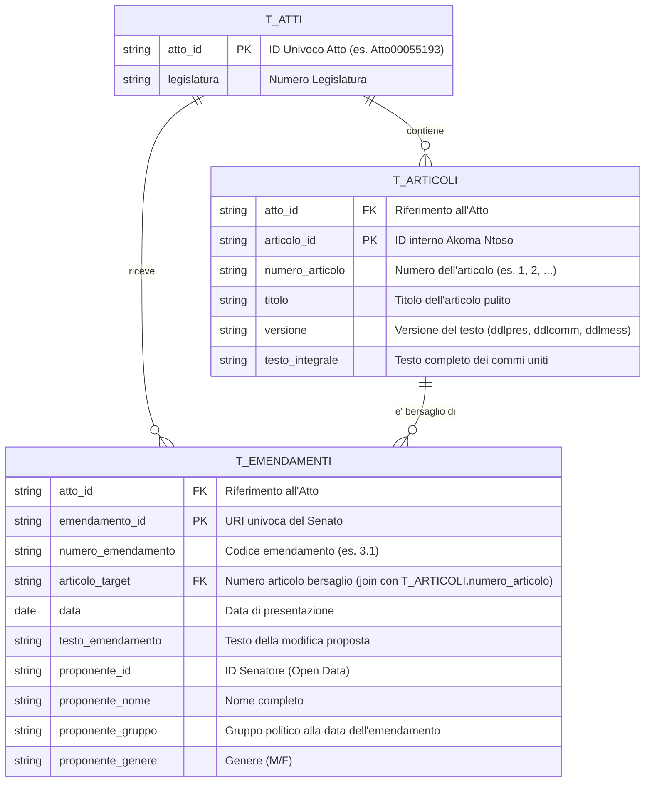

# Dataset Documentation: Sperti Legislative Analytics

Questo documento descrive la struttura del dataset tabellare generato per l'analisi della complessità legislativa e della frammentazione politica.

## 1. Architettura dei Dati (Schema ER)

Le tabelle CSV sono progettate per essere **relazionali** e facilmente joinabili in Excel, R, Stata o Python (pandas).

## 2. Come eseguire i Join

### Join Articoli -> Emendamenti
Per analizzare quali emendamenti hanno colpito un articolo specifico, usa:
*   `T_ARTICOLI.numero_articolo` <-> `T_EMENDAMENTI.articolo_target`
*   Assicurati di filtrare la `versione` in `T_ARTICOLI` (es. usa `ddlpres` come base).

### Join Emendamenti -> Anagrafica
La tabella `t_emendamenti` è già "denormalizzata" per proponente. Se un emendamento ha 5 firmatari, troverai 5 righe con lo stesso `emendamento_id` ma diversi `proponente_id`.

## 3. Processo di Trasformazione (Audit Log)

1.  **Parsing XML:** Estrazione gerarchica da standard Akoma Ntoso (Senato).
2.  **Mapping Politico:** Incrocio con Open Data Senato (RDF) per recuperare l'appartenenza ai gruppi parlamentari storicizzata.
3.  **Encoding Fix:** Rimozione di artefatti UTF-8 (es. `à` -> `à`) e normalizzazione spazi.
4.  **Flattening:** Trasformazione da JSON nidificato a CSV relazionale tramite script `flatten_custom.py`.

## 4. Posizione dei file
I dati per l'atto campione si trovano in:
`data/Leg19/[ATTO_ID]/flattened_custom/`
