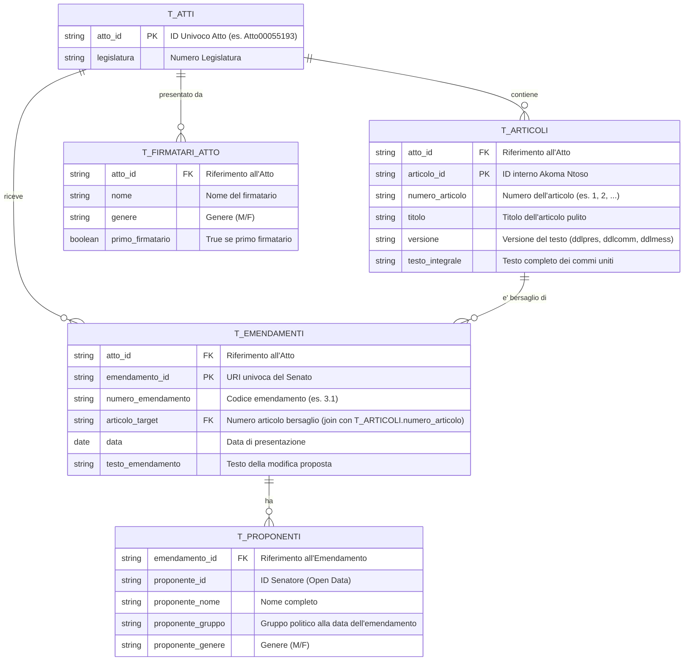

# Dataset Documentation

Questo documento descrive la struttura del dataset tabellare generato per l'analisi della complessità legislativa e della frammentazione politica.

## 1. Architettura dei Dati (Schema ER)

Le tabelle CSV sono progettate per essere **relazionali** e facilmente joinabili in Excel, R, Stata o Python (pandas).



## 2. Come eseguire i Join

### Join Atto → Firmatari
`T_ATTI.atto_id` ↔ `T_FIRMATARI_ATTO.atto_id`

Un atto con N firmatari ha N righe in `T_FIRMATARI_ATTO`. Il campo `primo_firmatario = true` identifica il primo firmatario; le righe restanti sono cofirmatari.

### Join Articoli → Emendamenti
Per analizzare quali emendamenti hanno colpito un articolo specifico:
- `T_ARTICOLI.numero_articolo` ↔ `T_EMENDAMENTI.articolo_target`
- Filtrare `versione = 'ddlpres'` in `T_ARTICOLI` per usare il testo di partenza come base.

### Join Emendamenti → Proponenti
`T_EMENDAMENTI.emendamento_id` ↔ `T_PROPONENTI.emendamento_id`

Un emendamento con N firmatari ha N righe in `T_PROPONENTI`, tutte con lo stesso `emendamento_id`.

### Esempio (SQL / DuckDB)
```sql
-- Quanti emendamenti per gruppo politico, per articolo?
SELECT e.articolo_target, p.proponente_gruppo, COUNT(DISTINCT e.emendamento_id) AS n
FROM t_emendamenti e
JOIN t_proponenti p ON e.emendamento_id = p.emendamento_id
GROUP BY e.articolo_target, p.proponente_gruppo
ORDER BY e.articolo_target, n DESC;
```

## 3. Processo di Trasformazione (Audit Log)

1. **Parsing XML:** Estrazione gerarchica da standard Akoma Ntoso (Senato).
2. **Mapping Politico:** Incrocio con Open Data Senato (RDF) per recuperare l'appartenenza ai gruppi parlamentari storicizzata.
3. **Encoding Fix:** Rimozione di artefatti UTF-8 (es. `Ã ` → `à`) e normalizzazione spazi.
4. **Flattening:** Trasformazione da JSON nidificato a CSV relazionale tramite `flatten_custom.py`.

## 4. Posizione dei file

```
data/Leg19/{ATTO_ID}/flattened_custom/
    t_atti.csv
    t_firmatari_atto.csv
    t_articoli.csv
    t_emendamenti.csv
    t_proponenti.csv
```
